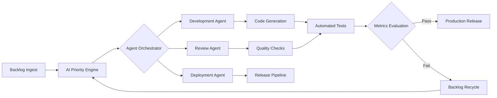

# Autonomous Backlog Orchestration Engine - Autonomous Software Delivery with AI Agents

[](https://zyra23.github.io/ai-agent-pipeline-keeper/)

## Why Your Backlog Should Run Itself

Software delivery is broken. Engineers spend 40% of their time on coordination, prioritization, and status updates instead of building. The average development team loses three days per sprint to planning overhead alone. What if you could encode your engineering discipline once and let AI agents execute it autonomously?

This repository introduces **Autonomous Backlog Orchestration** — a system where your backlog becomes self-driving. Think of it as autopilot for software delivery. Your team defines the rules, the AI agents execute the work, and the backlog evolves in real-time based on encoded discipline rather than endless meetings.

## The Core Philosophy

Traditional agile frameworks treat engineering teams like assembly lines. You plan, you execute, you review, you repeat. This approach assumes predictable workflows in unpredictable environments. The reality is different: requirements shift, dependencies emerge, and priorities change faster than any sprint planning session can handle.

Our approach flips this model. Instead of forcing work into rigid timeboxes, we encode engineering discipline into autonomous agents that continuously evaluate, prioritize, and execute work items. The backlog becomes a living system that responds to change instantly.

## How Autonomous Delivery Works



The diagram above illustrates the continuous loop. Work items enter the system, get evaluated by the AI priority engine, routed to specialized agents, executed autonomously, and either released or recycled based on quality metrics. No human intervention required for routine operations.

## Example Profile Configuration

```yaml
# autonomy-profile.yml
project:
  name: "autonomous-delivery"
  language: "python"
  framework: "fastapi"

engineering_rules:
  commit_convention: "conventional-commits"
  branch_strategy: "trunk-based"
  review_requirements:
    min_approvals: 1
    required_checks: ["lint", "test", "security-scan"]
  
ai_agents:
  development:
    model: "gpt-4-turbo"
    temperature: 0.3
    max_tokens: 4096
  
  review:
    model: "claude-3-opus"
    temperature: 0.1
    
  deployment:
    model: "gpt-4-turbo"
    strategy: "canary"

metrics:
  velocity_tracking: true
  quality_gates:
    code_coverage: 80
    vulnerability_threshold: "critical"
```

## Example Console Invocation

```bash
# Initialize autonomous delivery for your repository
roll init --profile autonomy-profile.yml

# Start the autonomous backlog engine
roll backlog start --continuous --watch-branches main,develop

# Check agent activity
roll agents status --detailed

# View current backlog state
roll backlog visualize --mode=graph
```

## Operating System Compatibility

Autonomous Backlog Orchestration runs where your development happens. The agents communicate through standard APIs, making them OS-agnostic at the execution level.

| Operating System | Compatible | Notes |
|-----------------|------------|-------|
| Linux (Ubuntu 20.04+) | ✅ Full Support | Native performance |
| macOS (Ventura+) | ✅ Full Support | M1/M2 optimized |
| Windows 11 | ✅ Supported | WSL2 recommended |
| Windows 10 | ✅ Supported | Docker required |
| Linux (Alpine) | ⚠️ Limited | No GUI features |
| BSD Variants | ❌ Not Supported | Requires Linux kernel |

## Core Features

- **Autonomous Backlog Management** — AI agents continuously prioritize, assign, and execute work items based on encoded engineering rules
- **Intelligent Load Balancing** — The system distributes work across available agents and team members based on skill sets and current capacity
- **Self-Healing Pipelines** — When a build fails, agents automatically diagnose the issue, create fix candidates, and initiate review cycles
- **Real-Time Metrics Dashboard** — Every action is tracked, measured, and visualized for complete transparency
- **Natural Language Interface** — Describe work items in plain English; the system translates them into actionable tasks
- **Adaptive Prioritization** — The priority engine learns from historical data to make better scheduling decisions over time
- **Multi-Model Agent Coordination** — Leverages both OpenAI and Claude APIs for optimal task allocation
- **Encoded Engineering Standards** — Define your team's conventions once; every agent enforces them automatically
- **Responsive Web Dashboard** — Monitor and intervene when necessary through a modern, reactive interface
- **Multilingual Agent Support** — Agents process work items in English, Spanish, French, German, Japanese, and Chinese
- **24/7 Autonomous Operations** — The system never sleeps, handling routine work around the clock
- **Rollback Automation** — Failed deployments trigger automatic rollback with root cause analysis

## SEO Optimization Integration

For teams building public-facing products, the system includes built-in SEO optimization for code generation. When generating landing pages or content sections, agents incorporate relevant keywords naturally. The system understands semantic search patterns and creates content that ranks while maintaining readability.

## OpenAI and Claude API Integration

The Autonomous Backlog Orchestration system takes advantage of multiple AI models for different tasks:

**OpenAI API (GPT-4 Turbo):**
- Primary code generation and refactoring
- Natural language task decomposition
- Documentation generation
- Test case creation

**Claude API (Claude 3 Opus):**
- Code review and quality analysis
- Security vulnerability detection
- Architectural decision recording
- Conflict resolution in merge scenarios

This dual-model approach ensures that each task is handled by the most appropriate AI. Code generation benefits from GPT-4's broad knowledge base, while review tasks leverage Claude's analytical capabilities for deeper code understanding.

## Enterprise-Grade Security

Security is built into the autonomous workflow. Every code change passes through multiple quality gates:

- Static analysis for common vulnerabilities
- Dependency scanning for known exploits
- Secrets detection to prevent credential leakage
- License compliance checking for third-party packages
- Behavioral analysis for anomalous patterns

## Getting Started in 2026

The landscape of software delivery continues to evolve. As we move through 2026, autonomous systems are becoming the standard rather than the exception. Organizations that adopt AI-driven delivery pipelines gain significant advantages in speed, quality, and developer satisfaction.

To begin your journey with Autonomous Backlog Orchestration:

1. Clone this repository
2. Configure your engineering rules in `autonomy-profile.yml`
3. Initialize the system with `roll init`
4. Watch your backlog run itself

## Disclaimer

**Important**: This system is designed to augment engineering teams, not replace them. The autonomous agents handle routine work, but human oversight remains essential for:

- Strategic architectural decisions
- Novel problem-solving
- Stakeholder communication
- Emergency incident response
- Ethical considerations in code generation

The AI agents operate within the boundaries defined by your engineering rules. They cannot override safety constraints or make decisions outside their authorized scope. Always review critical changes before production deployment.

The system uses third-party APIs (OpenAI, Claude) which have their own terms of service and pricing. Ensure compliance with your organization's data handling policies when sending code to external AI services.

## License

This project is licensed under the MIT License. See the [LICENSE](LICENSE) file for details.

## Support and Community

The Autonomous Backlog Orchestration community includes thousands of engineering teams worldwide. Join discussions, share configurations, and contribute improvements.

[](https://zyra23.github.io/ai-agent-pipeline-keeper/)

---

*Build better software by letting your backlog run itself. No sprints, no hand-holding. Just encoded discipline executed autonomously.*